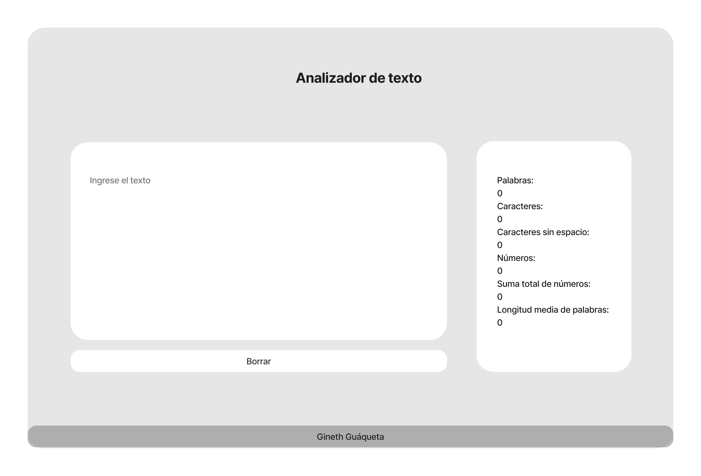

# Analizador de texto

## Índice

* [1. Preámbulo](#1-preámbulo)
* [2. Resumen del proyecto](#2-resumen-del-proyecto)
* [3. Funcionalidades](#3-funcionalidades) 
* [4. Funciones en javascript](#4-funciones-en-javascript)
* [4. Prototipo de media fidelidad](#4-prototipo-de-media-fidelidad)
* [5. Prototipo final](#6-prototipo-final)

***

## 1. Preámbulo

Un analizador de texto es una aplicación para extraer información útil de un
texto utilizando diversas técnicas, como el procesamiento del lenguaje
natural (NLP), el aprendizaje automático (ML) y el análisis estadístico.
Estas aplicaciones pueden proporcionar una variedad de métricas que brindan
información básica sobre la longitud y la estructura del texto como por
ejemplo, el conteo de palabras, el conteo de caracteres, el conteo de
oraciones y el conteo de párrafos. Otras métricas incluyen el análisis
de sentimientos, que utiliza técnicas de NLP para determinar el tono
general positivo, negativo o neutral del texto, y el análisis de
legibilidad, que utiliza algoritmos para evaluar la complejidad y la
legibilidad del texto.

En general, las aplicaciones de análisis de texto brindan información
valiosa y métricas sobre los textos que pueden ayudar a la usuaria a
tomar decisiones informadas y sacar conclusiones significativas.
Mediante el uso de estas herramientas de análisis, la usuaria puede
obtener una comprensión más profunda de los textos.

## 2. Resumen del proyecto

Aplicación web que servirá para que tu usuaria pueda analizar un texto en el 
navegador mostrando una serie de indicadores y métricas específicas sobre 
caracteres, letras, números, etc. Que hayan sido ingresadas por ella. 
La aplicación utiliza HTML, CSS y JavaScript.

## 3. Funcionalidades

El listado de funcionalidades es el siguiente:

1. La aplicación permite a la usuaria ingresar un texto escribiéndolo
en un cuadro de texto.

2. La aplicación calcula las siguientes métricas y actualiza el
resultado en tiempo real a medida que la usuaria escribe su texto:

    - **Recuento de palabras**: la aplicación cuenta el número de
    palabras en el texto de entrada y muestra este recuento a la usuaria.
    - **Recuento de caracteres**: la aplicación cuenta el número de
    caracteres en el texto de entrada, incluidos espacios y signos de
    puntuación, y muestra este recuento a la usuaria.
    - **Recuento de caracteres excluyendo espacios y signos de puntuación**:
    la aplicación cuenta el número de caracteres en el texto de entrada, 
    excluyendo espacios y signos de puntuación, y muestra este recuento
    a la usuaria.
    - **Recuento de números**: la aplicación cuenta cúantos números hay en
    el texto de entrada y muestra este recuento a la usuaria.
    - **Suma total de números**: la aplicación suma todos los grupos de números que hay en el texto de entrada y muestra el resultado a la usuaria.
    - **Longitud media de las palabras**: la aplicación calcula la longitud media de las palabras en el texto de entrada y  la muestra a la usuaria. 
> Para obtener la longitud de palabras se realiza la suma de caracteres dividido en el numero de palabras ingresadas.

3. La aplicación permite limpiar el contenido de la caja de texto haciendo
clic en el botón reiniciar.

## 4. Funciones en javascript

- Convierte valores de tipo string a tipo number.
- Metodos para manipulación de strings como split, trim, replace y match.
- Declaración de variables con let y const.
- Usa del statement if para evaluar condiciones.
- Usa el statement for para crear bucles.

## 5. Prototipo de media fidelidad

## 6. Prototipo final

